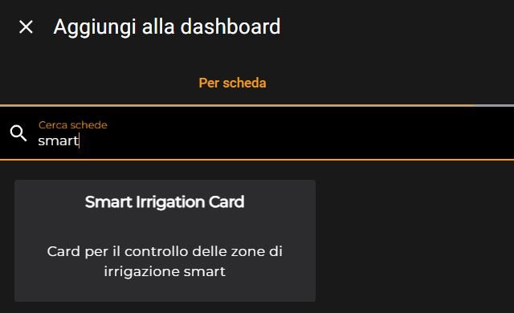

# 🌱 Zone Smart Irrigation Card

<div align="center">
  


[](https://www.paypal.com/donate/?business=48MF452S8876J&currency_code=EUR)

**A custom card for Home Assistant to manage smart multi-zone irrigation systems**

[🏠 Home Assistant](https://www.home-assistant.io/) | [📋 Installation](#-installation) | [⚙️ Configuration](#%EF%B8%8F-configuration) | [🐛 Issues](https://github.com/marcorm69/smart-irrigation-card/issues)

</div>

---

## 📸 Preview

<div align="center">
  
  
</div>

<div align="center">
  
</div>

---

## 🎯 Overview

The **Zone Smart Irrigation Card** is a custom card for Home Assistant that allows you to manage multi-zone irrigation systems in an intuitive and comprehensive way. This card works in perfect synergy with the [Zone Smart Irrigation](https://github.com/marcorm69/zone-smart-irrigation) integration.

> ⚠️ **IMPORTANT PREREQUISITE**  
> This card requires the **Zone Smart Irrigation** integration to work properly.  
> 👉 [Download the integration here](https://github.com/marcorm69/zone-smart-irrigation)

---

## ✨ Key Features

### 🔧 **Smart Zone Management**
- ✅ Enable/disable each individual zone
- 📅 Integrated weekly calendar
- ⏰ Management of 4 time slots per zone

### 📱 **Intuitive Interface**
- 🎨 Responsive and modern design
- 🔍 Zone selection via comboBox
- 👁️ Simplified view for disabled zones

### ⏱️ **Advanced Scheduling**
- 📆 Day of the week selection
- 🕐 Customizable start time
- ⏳ Configurable irrigation duration
- 🎯 Time slot 1 always active (when zone is active)
- 🔀 Other slots can be toggled on/off at will

---

## 🚀 Installation

### 📦 Via HACS (Recommended)

1. **Open HACS** in your Home Assistant
2. Go to **Frontend**
3. Search "Smart Irrigation card"
7. **Download** the card


### 🔧 Manual Installation

1. **Download files** from the `dist` folder
2. **Copy** files to `/config/www/smart-irrigation-card/`

```
<config directory>/
├── www/
│   └── smart-irrigation-card/
│       ├── smart-irrigation-card.js
│       ├── smart-irrigation-card-editor.js
│       └── smart-irrigation-zone-card.manifest.json
```

3. **Add resource** in Home Assistant:
   - Go to **Settings** ➜ **Dashboards** ➜ **Resources**
   - Click **Add Resource**
   - **URL**: `/local/smart-irrigation-card/smart-irrigation-card.js`
   - **Type**: `JavaScript Module`

4. **Restart** Home Assistant

---

## ⚙️ Configuration

### 🎛️ **Adding the Card**

1. 🏠 Go to your **dashboard**
2. ✏️ Click **Edit**
3. ➕ Click **Add Card**
4. 🔍 Search for **"Smart Irrigation Card"**
5. 🎯 Select the **zone** from the dropdown menu
6. 💾 **Save** the configuration

### 📋 **YAML Configuration (Optional)**

```yaml
type: custom:smart-irrigation-card
zone_name: <zone_name> (configurated with integration)
physical_switch_entity: irrigation.garden_zone
```

---

## 🛠️ Project Status

> 📝 **Development Note**  
> This project is currently in **active development**. Some features may not be complete and documentation is continuously being updated.
> 
> ⏳ Being a project developed in spare time, I cannot provide precise timelines for completion.
> 
> 🤝 **Contributions welcome!** Feel free to open issues or pull requests.

---

## 🆘 Support

- 🐛 **Bug reports**: [Open an issue](https://github.com/marcorm69/smart-irrigation-card/issues)
- 💡 **Feature requests**: [Discussions](https://github.com/marcorm69/smart-irrigation-card/discussions)
- 💖 **Support the project**: [](https://www.paypal.com/donate/?business=48MF452S8876J&currency_code=EUR)

---

## ⚖️ License and Disclaimer

### 📄 **License**
This project is released under **Apache License 2.0**.  
See the [LICENSE](LICENSE) file for complete details.

### ⚠️ **Disclaimer**
This project is distributed in the hope that it will be useful, but **WITHOUT ANY WARRANTY**; without even the implied warranty of **MERCHANTABILITY** or **FITNESS FOR A PARTICULAR PURPOSE**.

The author shall not be held liable for any damage or loss caused by the use of this software.

**Use at your own risk.**

---

<div align="center">

**Made with ❤️ for the Home Assistant Community**

⭐ If this project is useful to you, please leave a star on GitHub!

</div>