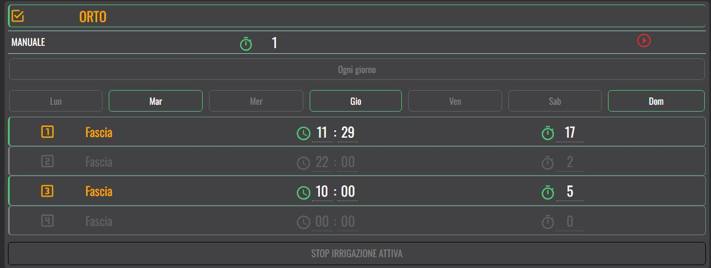
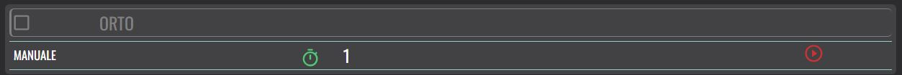

   [](https://www.paypal.com/donate/?business=48MF452S8876J&currency_code=EUR)

# Zone Smart Irrigation card




 


Custom integration for Home Assistant to manager a Zone Smart Irrigation System.

> ⚠️ **IMPORTANT**  
> This card working with a Zone Smart Irrigation integration
> https://github.com/marcorm69/zone-smart-irrigation

The card allows you to manage multi-zone irrigation, based on the Zone Smart Irrigation integration.
In the configuration window, simply choose one of the zones created through integration from a comboBox to manage that zone.

Features
	* You can activate or deactivate each individual zone.
	* When deactivated, the card will only display the zone name and the manual irrigation line.
	* When activated, a weekly calendar and 4 time slots will be shown.
	* You can select the days of the week to start irrigation based on the times defined by the time slots below.
	* Time slot 1 is always active (only deactivated if the zone itself is deactivated).
	* The other time slots can be toggled on or off at will.
	* For each time slot, you can set the start time and irrigation duration.


> This guide is still incomplete.  
> The code still has some shortcomings.  
> This work is part of my spare time, I can't give any indication when it will be completed.  


## Disclaimer

This project is distributed in the hope that it will be useful,  
but WITHOUT ANY WARRANTY; without even the implied warranty of  
MERCHANTABILITY or FITNESS FOR A PARTICULAR PURPOSE.  

The author shall not be held liable for any damage or loss caused by the use of this software.  
Use at your own risk.


## License

This project is licensed under the Apache License 2.0.

See the LICENSE file for details.


## Installation

### Manual

1. Copy the files in  `dist` in `/config/www/smart-irrigation-card/`
```
<config directory>/
|-- www/
|   |-- smart-irrigation-card/
|       |-- smart-irrigation-card.js
|       |-- smart-irrigation-card-editor.js
|       |-- smart-irrigation-zone-card.manifest.json
```

2. Import the module

Go to to UI **Settings > Integration > Resource (three dots)** and add resource 
URL: <config directory>/www/smart-irrigation-card/smart-irrigation-card.js
Type: module

## Configuration

1. Go to your dashboard\view
2. Click Edit 
3. Click "Add card"
4. Search "Smart Irrigation Card"

In configuration window choose the area you want to display among those configured with the integration.

Enjoy

